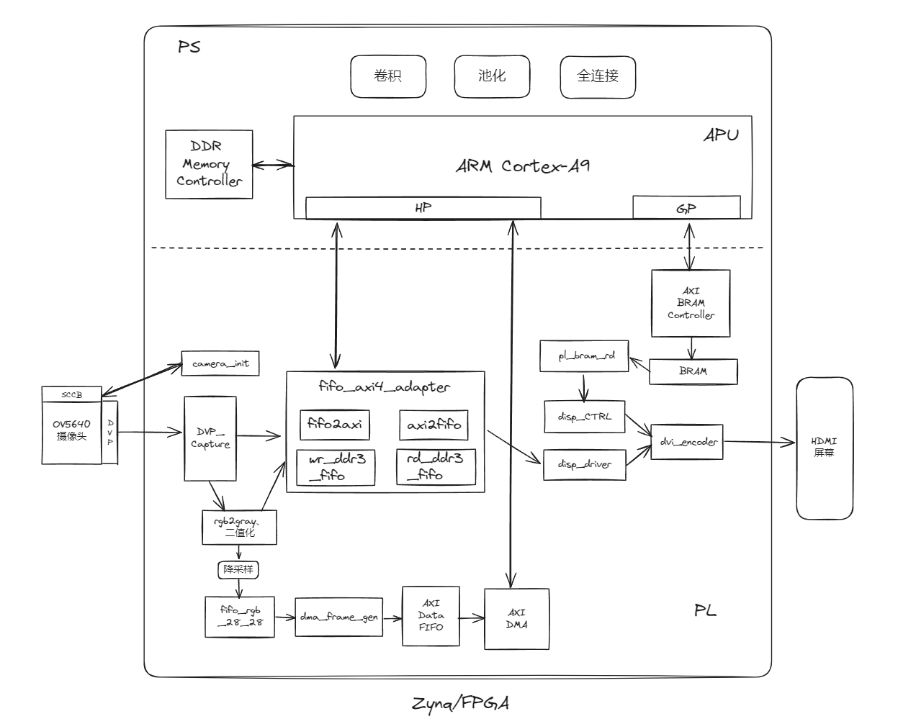

# zynq-fpga-cnn-digital-recognition
Zynq/FPGA实现CNN手写数字(0-9)识别

------

基于Verilog与C，开发软件为Vivado 2018.3及Xilinx SDK 2018.3，硬件平台为zynq7010。

效果演示视频：[Zynq/FPGA实现CNN手写数字识别_哔哩哔哩_bilibili](https://www.bilibili.com/video/BV1oK88eLEMy/)

——————

本设计目前的实现方案（暂且如此，之后会继续优化）：

①PL侧，OV5640摄像头采集图像；

②PL侧，将图像采集区域内，包含待识别的数字的部分，进行rgb转gray以及二值化处理；

③PL侧，将待识别数字图像（即二值化后的图像）及背景图像（即OV5640采集图像区域内的、非待识别数字区域），通过一个fifo接口到AXI4接口的转换模块，存储到DDR3之中；

④PL侧，将待识别的数字的图像区域进行降采样，并将结果通过DMA存到DDR3中；

⑤PS侧，通过DMA读取DDR中存储的待识别的数字的图像数据（经过了PL侧的降采样），进行CNN识别（卷积，池化，全连接）；

⑥PS侧，将数字识别结果写入BRAM；

⑦PL侧，读取BRAM中的数字识别结果，并通过一个AXI4接口到fifo接口的转换模块，读取DDR3中的图像数据（待识别数字图像及背景图像）；

⑧PL侧，将数字识别结果、待识别数字图像以及背景图像，以rgb数据的形式，并进行tmds编码，显示到HMDI接口的屏幕。

本设计目前的简单框图

——————

后续的主要优化方向：

实现在PL侧加速CNN。

------

注：

①本设计为SDK工程，需要通过SDK烧录

②本设计目前的PS侧CNN识别（卷积，池化，全连接），参考学习了bilibili UP主“开源骚客FPGA”的开源代码，在此表示感谢！！

③本设计目前的PL侧的部分Verilog代码，参考学习了bilibili UP主“小梅哥爱漂流”及“正点原子官方”的开源代码，在此表示感谢！！

④本设计目前的其他参考学习资料：（在此表示感谢！！）

CSDN文章：[ZYNQ通过AXI DMA实现PL发送连续大量数据到PS DDR_zynq axidma-CSDN博客](https://blog.csdn.net/QDchenxr/article/details/134325391)

